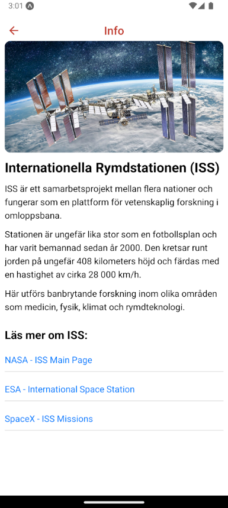
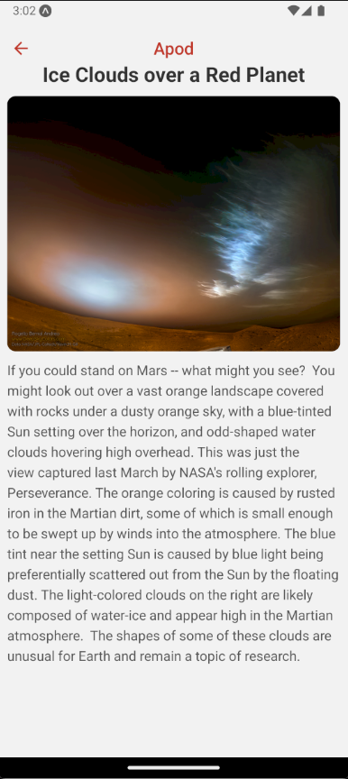
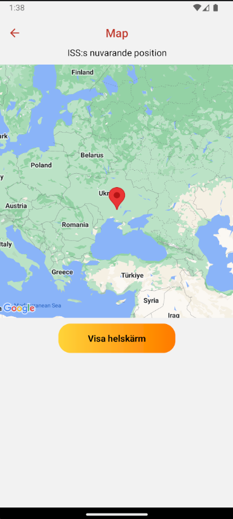
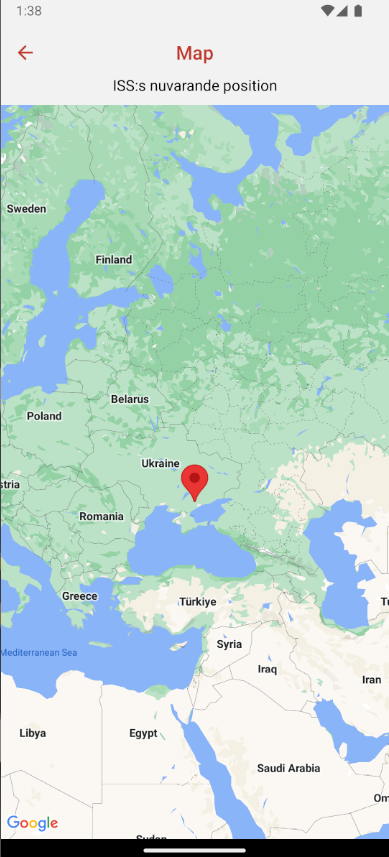

# --SV

# ISS Tracker

En interaktiv mobilapplikation som visar realtidspositionen för den internationella rymdstationen (ISS).
Applikationen använder modern teknologi som React Native och Expo för att leverera en sömlös användarupplevelse.

# 📋 Funktioner

- Realtidspositionering av ISS med hjälp av Google Maps.
- Elegant användargränssnitt med hjälp av React Native komponenter och animationer.
- Integration med API:er för datainhämtning om ISS.

# 🛠️ Teknikstack
- Frontend: React Native, Expo
- Navigation: React Navigation
- API: Axios, Open Notify ISS API, NASA Astronomy Picture of the Day API
- Kartor: React Native Maps
- UI: React Native Vector Icons och Linear Gradient

# 📦 Beroenden
### Produktion
- @react-navigation/stack - Hantering av navigeringsstack.
- axios - För API-anrop.
- expo - Huvudramverket för utveckling och distribution.
- react-native-maps - Google Maps-integration.
- react-native-linear-gradient - Gradientbakgrunder.
- react-native-reanimated - Smidiga animationer.
- react-native-vector-icons - Ikonpaket.

### Utveckling
- @babel/core - För transpilation av modern JavaScript.

# 🚀 Kom igång

1. Installation
Klona detta repo:
- git clone https://github.com/Lucifer87878/ISS-Tracker.git
- cd iss-tracker

2. Installera beroenden:
- npm install

3. Starta applikationen:
- npm start

## Tillgängliga skript

- npm start: Startar Expo-utvecklingsservern.
- npm run android: Startar appen på en Android-enhet/emulator.
- npm run ios: Startar appen på en iOS-enhet/simulator.
- npm run web: Startar appen i webbläsaren.

# 🌐 API
## ISS Position API
- URL: http://api.open-notify.org/iss-now.json
- Beskrivning: Hämtar realtidsdata om ISS position.

## NASA Astronomy Picture of the Day API
- URL: https://api.nasa.gov/planetary/apod?api_key=DEMO_KEY
- Beskrivning: Hämtar en bild och beskrivning från NASA:s Astronomy Picture of the Day.

# 💻 Bidra

1. Forka detta repo.

2. Skapa en ny branch:
- git checkout -b feature/my-new-feature

3. Gör dina ändringar och commita:
- git commit -m "Lägg till en ny funktion"

4. Push till branchen:
- git push origin feature/my-new-feature

5. Skicka en pull request.

# 👨‍💻 Författare
- Lucifer - Utvecklare och projektägare.

# //________________________________________________________________________________________________________________________//

# --ENG

# ISS Tracker

An interactive mobile application that displays the real-time position of the International Space Station (ISS).
The application leverages modern technologies like React Native and Expo to provide a seamless user experience.

# 📋 Features

- Real-time positioning of the ISS using Google Maps.
- Elegant user interface using React Native components and animations.
- Integration with APIs to fetch ISS-related data.

# 🛠️ Tech Stack
- Frontend: React Native, Expo
- Navigation: React Navigation
- API: Axios, Open Notify ISS API, NASA Astronomy Picture of the Day API
- Maps: React Native Maps
- UI: React Native Vector Icons and Linear Gradient

# 📦 Dependencies
### Production
- @react-navigation/stack - Navigation stack handling.
- axios - For API calls.
- expo - Main framework for development and distribution.
- react-native-maps - Google Maps integration.
- react-native-linear-gradient - Gradient backgrounds.
- react-native-reanimated - Smooth animations.
- react-native-vector-icons - Icon package.

### Development
- @babel/core - For transpiling modern JavaScript.

# 🚀 Getting Started

1. Install
Klona detta repo:
- git clone https://github.com/Lucifer87878/ISS-Tracker.git
- cd iss-tracker

2. Install dependencies:
- npm install

3. Run the application:
- npm start

## Available Scripts

- npm start: Launches the Expo development server.
- npm run android: Runs the app on an Android device/emulator.
- npm run ios: Runs the app on an iOS device/simulator.
- npm run web: Runs the app in a web browser.

# 🌐 API
## ISS Position API
- URL: http://api.open-notify.org/iss-now.json
- Description: Fetches real-time position data of the ISS.

## NASA Astronomy Picture of the Day API
- URL: https://api.nasa.gov/planetary/apod?api_key=DEMO_KEY
- Description: Fetches an image and description from NASA's Astronomy Picture of the Day.

# 💻 Contributing

1. Fork this repo.

2. Create a new branch:
- git checkout -b feature/my-new-feature

3. Make your changes and commit:
- git commit -m "Lägg till en ny funktion"

4. Push to the branch:
- git push origin feature/my-new-feature

5. Submit a pull request.

# 👨‍💻 Author
- Lucifer - Developer and project owner.

